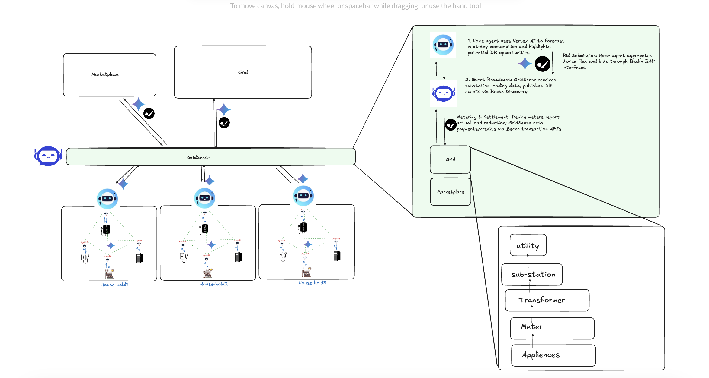

# GridSense
[](LICENSE)  
[](https://www.becknprotocol.io/)  
[](https://cloud.google.com/vertex-ai)
[](https://google.github.io/adk-docs/)

**Problem Statement 2:** Consumer/Prosumer Agent for Personalized Energy Intelligence

The consumer/prosumer needs to reduce their energy costs and contribute to grid stability, without compromising convenience, while being non-intrusive.  Challenge: Design a household-level agent that empowers users to participate in demand flexibility while safeguarding comfort, convenience, and trust.

**GridSense** is an agentic demand-response marketplace for residential and small-commercial energy users.  
Built on the open **Beckn-ONIX** protocol and powered by Google Cloud’s **Agent Development Kit(ADK)**, GridSense enables households to discover, bid, and automate flexible load adjustments—such as HVAC, EV charging, and water heating—in response to dynamic grid signals.

By coordinating AI agents across devices, GridSense enhances grid stability, unlocks revenue streams for participants, and accelerates decarbonization.


# Team Members

1. Sumesh Meppadath
2. Bhumika Makwana

## 🧭 GridSense Architecture
At a high level, we have:
 
1. **Device Layer:** Agentic software wrappers on each flexible appliance (HVAC, EV charger, water heater)

2. **Household Agent Layer:** A centralized, user‑personalized “home agent” that aggregates device agents, provides user recommendations, and manages consented control flows

3. **GridSense Marketplace Layer:** A Beckn-based network proxy that broadcasts grid signals, runs the demand‑response marketplace, and settles micropayments

4. **Grid/Utility Layer:** Transmission/distribution system operators (TSOs/DSOs) and utilities issuing real‑time grid stress or pricing events


---

#### 🔧 Challenges Addressed
 - **1. Peak Demand Spikes:** Uncoordinated residential loads—like air conditioners and EVs—exacerbate grid peaks, triggering expensive, dirty peaker plants and risking outages.
 - **2. Siloed Energy Management:** Most home energy systems are proprietary and isolated, limiting large-scale aggregated demand-response.
 - **3. Monetization & User Engagement:** Consumers lack simple, automated ways to earn by adjusting flexible loads—leading to low participation.


#### ⚙️ Core Concept

GridSense enables multi-transactional AI agents to autonomously:
- **Discover**: Identify demand-response events using Beckn discovery APIs.
- **Negotiate**: Bid flexible load reductions in return for dynamic payments via RL-driven strategies.
- **Execute**: Automate load curtailment, meter adjustments, and settle micropayments using Beckn transaction APIs.

#### 🎯 What Does GridSense Do?
GridSense turns homes into “smart allies” of the grid.

#### Agents inside devices:
- **Listen** to grid signals like "high price now!" or "load shedding ahead!"
- **Decide** how to adjust (e.g., reduce AC by 1°C or delay EV charging)
- **Bid** into a real-time marketplace (e.g., "I can cut 1kW for ₹10")
- **Earn** incentives automatically when the bid is accepted
- **Restore** operation when grid conditions normalize


## Tech Stack

- **Beckn Protocol** – for open energy interoperability  
- **Google Agent Development kit (Adk)** – Agent development, Agent to Agent communication
- **Programming Language** - Python, Typescript, others
- **Database** - supabase
- **Google Cloud Shell** quick prototyping and deployment from the browser with pre-configured cloud credentials.

## Setup Instructions
Follow these steps:

```sh
# Step 1: Clone the repository using the project's Git URL.
git clone <YOUR_GIT_URL>

# Step 2: Navigate to the project directory.
cd <YOUR_PROJECT_NAME>

# Step 3: Install the necessary dependencies.
npm i

# Step 4: Start the development server with auto-reloading and an instant preview.
npm run dev
```
#### Running Agent code(src/) on google codelabs
basic setup - https://codelabs.developers.google.com/instavibe-adk-multi-agents/instructions?hl=en#2

```sh
export REPO_NAME=<REPO_NAME>
gcloud artifacts repositories create $REPO_NAME \
  --repository-format=docker \
  --location=<REGION> \
  --description="Docker repository for gridsense"


cd ~/app/
export PROJECT_ID=$(gcloud config get-value project)
export REGION=<REGION> 
export REPO_NAME=<REPO_NAME>           # e.g. “introveally-repo”
export IMAGE_TAG="latest"
export IMAGE_NAME=<IMAGE_NAME>
export IMAGE_PATH="${REGION}-docker.pkg.dev/${PROJECT_ID}/${REPO_NAME}/${IMAGE_NAME}:${IMAGE_TAG}"
export SERVICE_NAME=<SERVICE_NAME>
export MCP_SERVER_URL=$(gcloud run services list --platform=managed --region=us-central1 --format='value(URL)' | grep mcp-tool-server)/sse

gcloud builds submit . \
  --project="${PROJECT_ID}" \
  --tag="${IMAGE_PATH}"

# 4. Deploy to Cloud Run (managed), allow unauthenticated calls
gcloud run deploy "${SERVICE_NAME}" \
  --project="${PROJECT_ID}" \
  --platform=managed \
  --region="${REGION}" \
  --image="${IMAGE_PATH}" \
  --allow-unauthenticated \
  --set-env-vars="MCP_SERVER_URL=${MCP_SERVER_URL}" \
  --set-env-vars="APP_HOST=0.0.0.0,APP_PORT=8080" \
  --min-instances=1

```
## Demo Video Link

- **Deployed Endpoint** - https://gridwave-harmony-ai.vercel.app
- **Mcp server** - https://mcp-tool-server-603141740756.us-central1.run.app/sse
- **Video Demonstration** -
    - **part1** - https://www.loom.com/share/3977ef0088f2495e8c70fca6e0324e47?sid=0a7e6758-41e6-4ab2-9f51-9d7c33ce3b87
    - **part2** - https://www.loom.com/share/09e0c038fb724b2a95cc9e2447082ba9?sid=572186f8-3b19-436b-bbe9-dd958c5a093e
    - **part3** - https://www.loom.com/share/d22ce31bcfaa41ea82e88c7da50bc2d5?sid=11591e86-7e1a-45c5-b951-4cbebb3fa124

## Challenges & Learnings:
- Integrating Beckn APIs (BAP/BPP) and Google ADK with our system required extensive adaptation of energy-specific semantics
- Designing autonomous agents that communicate reliably and securely using the Beckn Protocol required a deep understanding of the ONDC-style open ecosystem and agent contracts.
- Beckn’s open architecture fosters a plug-and-play ecosystem across energy, commerce, and devices—making decentralization practical for demand-response.
- Building for interoperability from day one (e.g., using Supabase, open APIs, and schema-first design) made it easier to scale, extend, and debug complex agent interactions.


##  Useful Resources
- https://google.github.io/adk-docs/
- https://becknprotocol.io/
- https://modelcontextprotocol.io/introduction
- https://google.github.io/A2A/
- https://cloud.google.com/generative-ai-studio?hl=en
- 
## 📜 License

This project is licensed under the MIT License — see the [LICENSE](LICENSE) file for details.

---
